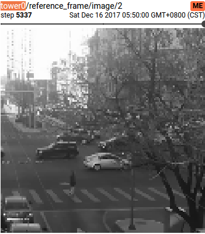
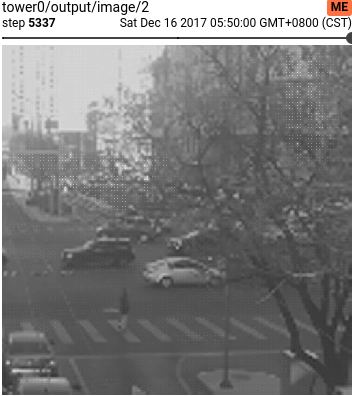
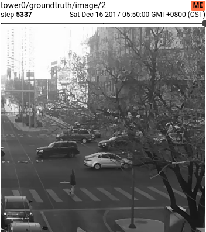

# Overview

# TODOs
- [ ] Tensorboard Support
- [ ] GIF demonstration

# Usage
- Preprocess
- Train
- Predict
- Load model
# Results
## Image Results
|Input|Output|Groundtruth|
|:---:|:---:|:---:|
||||

## Metrics
(PSNR/SSIM)

| Method | Ours | Paper |
|:---:|:---:|:---:|
| ×2 |  | 36.71 / 0.96 |
| ×3 |  | 31.92 / 0.90 |
| ×4 |  | 29.69 / 0.84 |

# References
- Paper: [Detail-revealing Deep Video Super-resolution](https://arxiv.org/abs/1704.02738)
- Offical Repo: [jiangsutx/SPMC_VideoSR](https://github.com/jiangsutx/SPMC_VideoSR)